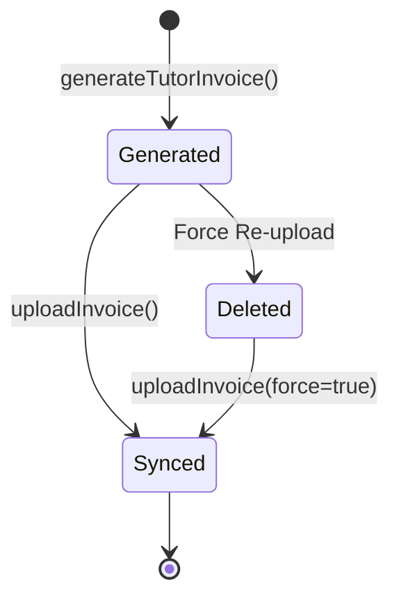

## Overview

The invoice system automates monthly invoice generation for tutors and synchronizes them with Fatture in Cloud, Italy's leading invoicing platform. This ensures compliance with Italian fiscal requirements and provides tutors with official invoices for their earnings.

## Fatture in Cloud Integration

### Configuration

```properties
fattureincloud.secret=YOUR_API_TOKEN
```

The system uses the Fatture in Cloud SDK to interact with their API:

```kotlin
@ApplicationScoped
class FattureInCloudClient(
    @ConfigProperty(name = "fattureincloud.secret")
    private var token: String
) {
    private var apiClient: ApiClient = Configuration.getDefaultApiClient()
    
    init {
        apiClient.basePath = "https://api-v2.fattureincloud.it"
        
        (apiClient.getAuthentication("OAuth2AuthenticationCodeFlow") as OAuth)
            .apply {
                accessToken = token
            }
    }
    
    val userApi: UserApi
        get() = UserApi(apiClient)
    
    val issuedDocumentApi: IssuedDocumentsApi
        get() = IssuedDocumentsApi(apiClient)
}
```

Source: `FattureInCloudClient.kt:12-33`

## Invoice Resource (GraphQL)

### Query: getTutorInvoices

Retrieve all invoices for the authenticated tutor.

<ResponseField name="invoices" type="List<TutorInvoice>">
  List of invoices for the authenticated tutor
</ResponseField>

```kotlin
@Query
@Authenticated
fun getTutorInvoices(): List<TutorInvoice> {
    val tutor = identityUtil.account
    return invoiceService.getTutorInvoices(tutorId = tutor.id)
}
```

Source: `InvoiceResource.kt:28-33`

### Query: getAllInvoices

Retrieve all invoices across all tutors (admin only).

<ResponseField name="invoices" type="List<TutorInvoice>">
  Complete list of all tutor invoices
</ResponseField>

```kotlin
@Query
@AdminAccess
fun getAllInvoices(): List<TutorInvoice> {
    return invoiceService.getAllInvoices()
}
```

Source: `InvoiceResource.kt:36-39`

### Query: getTutorInvoicesByTutor

Retrieve invoices for a specific tutor.

<ParamField query="tutorId" type="BigInteger" required>
  The tutor's ID
</ParamField>

<ResponseField name="invoices" type="List<TutorInvoice>">
  List of invoices for the specified tutor
</ResponseField>

```kotlin
@Query
fun getTutorInvoicesByTutor(tutorId: BigInteger): List<TutorInvoice> {
    return invoiceService.getTutorInvoices(tutorId = tutorId)
}
```

Source: `InvoiceResource.kt:42-45`

### Query: getTutorInvoice

Get a specific invoice for the authenticated tutor by year and month.

<ParamField query="year" type="Int" required>
  The invoice year (e.g., 2026)
</ParamField>

<ParamField query="month" type="Int" required>
  The invoice month (1-12)
</ParamField>

<ResponseField name="invoice" type="TutorInvoice">
  The invoice for the specified period
</ResponseField>

```kotlin
@Query
@Authenticated
fun getTutorInvoice(year: Int, month: Int): TutorInvoice {
    val tutorId = identityUtil.account.id
    return invoiceService.getInvoiceByTutorMonthAndYear(
        tutorId = tutorId, 
        year = year, 
        month = month
    ) ?: throw Exception("Invoice not found")
}
```

Source: `InvoiceResource.kt:128-133`

### Query: getTutorAllInvoices

Get all invoices for a specific month and year (admin only).

<ParamField query="year" type="Int" required>
  The invoice year
</ParamField>

<ParamField query="month" type="Int" required>
  The invoice month
</ParamField>

<ResponseField name="invoices" type="List<TutorInvoice>">
  All invoices for the specified period
</ResponseField>

```kotlin
@Query
@AdminAccess
fun getTutorAllInvoices(year: Int, month: Int): List<TutorInvoice> {
    return invoiceService.getInvoices(year = year, month = month)
}
```

Source: `InvoiceResource.kt:137-140`

### Query: countTutorAllInvoices

Count invoices for a specific period (admin only).

<ParamField query="year" type="Int" required>
  The invoice year
</ParamField>

<ParamField query="month" type="Int" required>
  The invoice month
</ParamField>

<ResponseField name="count" type="Long">
  Total number of invoices
</ResponseField>

## Invoice Generation Mutations

### generateTutorInvoice

Generate an invoice for a specific tutor for a given month and year.

<ParamField body="tutorId" type="BigInteger" required>
  The tutor's ID
</ParamField>

<ParamField body="year" type="Int" required>
  The invoice year
</ParamField>

<ParamField body="month" type="Int" required>
  The invoice month (1-12)
</ParamField>

<ResponseField name="invoice" type="TutorInvoice">
  The newly generated invoice
</ResponseField>

```kotlin
@Mutation
@Transactional
@Description("Genera una fattura per un singolo tutor per un mese anno specificato")
fun generateTutorInvoice(
    tutorId: BigInteger, 
    year: Int, 
    month: Int
): TutorInvoice {
    return invoiceService.generateTutorInvoice(tutorId, year, month)
}
```

Source: `InvoiceResource.kt:57-61`

### generateCurrentMonthTutorInvoices

Generate invoices for all tutors for the current month.

<ResponseField name="response" type="GenericResponse">
  Response indicating success or failure of bulk generation
</ResponseField>

```kotlin
@Mutation
@Description("Genera le invoice per tutti i tutor per un mese anno specificato")
fun generateCurrentMonthTutorInvoices(): GenericResponse {
    return try {
        invoiceService.generateTutorInvoicesCurrentMonth()
        GenericResponse(
            status = Status.SUCCESS, 
            message = "Invoices generated"
        )
    } catch (error: Error) {
        GenericResponse(
            status = Status.ERROR, 
            message = "Invoices not generated"
        )
    }
}
```

Source: `InvoiceResource.kt:63-73`

### uploadInvoice

Upload a specific invoice to Fatture in Cloud.

<ParamField body="invoiceId" type="BigInteger" required>
  The invoice ID to upload
</ParamField>

<ParamField body="force" type="Boolean" default="false">
  Force re-upload even if already synced
</ParamField>

<ResponseField name="response" type="GenericResponse">
  Response containing the Fatture in Cloud invoice number
</ResponseField>

```kotlin
@Mutation
@Transactional
@Description("Carica una specifica fattura su fatture in cloud")
fun uploadInvoice(invoiceId: BigInteger, force: Boolean = false): GenericResponse {
    val response = fattureInCloudService.uploadInvoice(invoiceId, force)
    return GenericResponse(
        status = Status.SUCCESS, 
        message = response?.data?.number.toString()
    )
}
```

Source: `InvoiceResource.kt:47-53`

## Fatture in Cloud Service

### Upload Invoice Implementation

```kotlin
fun uploadInvoice(
    invoiceId: BigInteger, 
    force: Boolean = false
): CreateIssuedDocumentResponse? {
    val ti = TutorInvoice.findById<TutorInvoice>(invoiceId) 
        ?: throw Exception("Invoice not found $invoiceId")
    
    logger.info { "Start invoice sync ${ti.uuid}" }
    
    if (ti.synced && !force) 
        throw Exception("The invoice ${ti.uuid} is already synchronized")
    
    val userApiInstance = fattureInCloudClient.userApi
    val apiInstance = fattureInCloudClient.issuedDocumentApi
    
    try {
        // Retrieve the first company id
        val userCompanies = userApiInstance.listUserCompanies()
        val companyId = userCompanies.data?.companies!![0].id
        
        if (force && ti.syncDocumentId != null) {
            logger.info { "Force invoice sync ${ti.uuid}" }
            logger.info { "Delete existing invoice with id ${ti.syncDocumentId}" }
            apiInstance.deleteIssuedDocument(companyId, ti.syncDocumentId)
        }
        
        val invoice = buildInvoice(ti = ti)
        
        val createIssuedDocumentRequest = CreateIssuedDocumentRequest()
            .data(invoice)
        
        val response = apiInstance.createIssuedDocument(
            companyId, 
            createIssuedDocumentRequest
        )
        
        if (response.data?.number != null)
            ti.apply {
                synced = true
                syncDate = LocalDateTime.now()
                syncNumber = BigInteger.valueOf(response?.data?.number!!.toLong())
                syncInvoiceUrl = response?.data?.url
                syncDocumentId = response?.data?.id
            }.also { it.persistAndFlush() }
        
        logger.info { "Sync invoice done ${ti.uuid} with number ${ti.syncNumber}" }
        
        return response
        
    } catch (error: Error) {
        throw Exception(error.message)
    }
}
```

Source: `FattureInCloudService.kt:22-74`

### Build Invoice Document

```kotlin
private fun buildInvoice(ti: TutorInvoice): IssuedDocument? {
    val siglaProvincia = Provincia.getByProvincia(ti.customerProvince)
        ?: throw Exception("Provincia ${ti.customerProvince} not found")
    
    val entity = Entity()
        .name(ti.customerName)
        .taxCode(ti.customerFiscalCode)
        .addressStreet(ti.customerAddress)
        .addressPostalCode(ti.customerPostcode)
        .addressCity(ti.customerCity)
        .addressProvince(siglaProvincia.sigla)
        .countryIso(ti.customerCountry)
    
    val invoice = IssuedDocument()
        .type(IssuedDocumentType.INVOICE)
        .entity(entity)
        .date(LocalDate.of(ti.emissionYear, ti.emissionMonth, 5))
        .numeration("/fatt")
        .subject("Utilizzo piattaforma mese di ${ti.month}/${ti.year}")
        .visibleSubject("Utilizzo piattaforma mese di ${ti.month}/${ti.year}")
        .currency(Currency().id("EUR"))
        .language(
            Language()
                .code("it")
                .name("italiano")
        )
        .useGrossPrices(true)
        .eInvoice(true)
        .eiData(
            IssuedDocumentEiData()
                .originalDocumentType(null)
                .paymentMethod("MP22")
        )
        .addPaymentsListItem(
            IssuedDocumentPaymentsListItem()
                .amount(ti.total)
                .dueDate(LocalDate.of(ti.emissionYear, ti.emissionMonth, 6))
                .paidDate(LocalDate.of(ti.emissionYear, ti.emissionMonth, 5))
                .status(IssuedDocumentStatus.PAID)
                .paymentTerms(
                    IssuedDocumentPaymentsListItemPaymentTerms()
                        .type(PaymentTermsType.STANDARD)
                )
                .paymentAccount(PaymentAccount().id(1134356))
        )
    
    ti.rows.forEach {
        invoice.addItemsListItem(
            IssuedDocumentItemsListItem()
                .name(it.description)
                .grossPrice(it.totalAmount)
                .qty(BigDecimal(it.quantity))
                .vat(VatType().id(0))
        )
    }
    
    return invoice
}
```

Source: `FattureInCloudService.kt:77-138`

## Invoice Structure

### TutorInvoice Entity

An invoice contains:

- **Tutor Information**: ID, name, fiscal details
- **Customer Information**: Name, address, fiscal code
- **Period**: Month and year for the invoice
- **Amounts**: Total, subtotal, taxes
- **Emission Date**: When the invoice was generated
- **Sync Status**: Whether synced with Fatture in Cloud
- **Sync Data**: Document ID, number, URL from Fatture in Cloud
- **Rows**: Individual line items for each payment

### Invoice Rows

Each invoice row represents:
- Description of the service
- Quantity (typically hours or lessons)
- Unit amount
- Total amount

## Payment Reconciliation Queries

### tutorRecap

Get a summary of the authenticated tutor's earnings.

```kotlin
@Query
@Authenticated
fun tutorRecap() = identityUtil.authAccount {
    tutorService.getTutorRecap(tutorId = it.id)
}
```

Source: `InvoiceResource.kt:77-82`

### tutorRecapByTutor

Get earnings summary for a specific tutor.

<ParamField query="tutorId" type="BigInteger" required>
  The tutor's ID
</ParamField>

```kotlin
@Query
fun tutorRecapByTutor(tutorId: BigInteger) =
    tutorService.getTutorRecap(tutorId = tutorId)
```

Source: `InvoiceResource.kt:85-89`

### tutorFullRecapByTutor

Get detailed earnings breakdown for a tutor.

<ParamField query="tutorId" type="BigInteger" required>
  The tutor's ID
</ParamField>

```kotlin
@Query
fun tutorFullRecapByTutor(tutorId: BigInteger) =
    tutorService.getTutorFullRecap(tutorId = tutorId)
```

Source: `InvoiceResource.kt:92-96`

### tutorPacketRecapByTutor

Get packet-specific earnings for a tutor.

<ParamField query="tutorId" type="BigInteger" required>
  The tutor's ID
</ParamField>

```kotlin
@Query
fun tutorPacketRecapByTutor(tutorId: BigInteger) =
    tutorService.getTutorPacketRecap(tutorId = tutorId)
```

Source: `InvoiceResource.kt:99-103`

### getTutorPaymentPackets

Get payment packet list for the authenticated tutor.

```kotlin
@Query
fun getTutorPaymentPackets() = identityUtil.authAccount {
    tutorService.getPaymentPacketList(tutorId = it.id)
}
```

Source: `InvoiceResource.kt:105-110`

### getTutorPaymentPacketsByTutor

Get payment packets for a specific tutor.

<ParamField query="tutorId" type="BigInteger" required>
  The tutor's ID
</ParamField>

<ResponseField name="packets" type="List<PaymentPacketsView>">
  List of payment packets for the tutor
</ResponseField>

```kotlin
@Query
fun getTutorPaymentPacketsByTutor(tutorId: BigInteger): List<PaymentPacketsView> {
    return tutorService.getPaymentPacketList(tutorId = tutorId)
}
```

Source: `InvoiceResource.kt:112-117`

### getTutorPaymentPacketsByStatus

Filter payment packets by status.

<ParamField query="status" type="Boolean" required>
  Filter by transferred status (true/false)
</ParamField>

<ResponseField name="packets" type="List<PaymentPacketsView>">
  Filtered payment packets
</ResponseField>

```kotlin
@Query
fun getTutorPaymentPacketsByStatus(status: Boolean): List<PaymentPacketsView> {
    return tutorService.getPaymentPacketList(status = status)
}
```

Source: `InvoiceResource.kt:119-124`

## Invoice Lifecycle



1. **Generated**: Invoice created in Schoolr database
2. **Synced**: Invoice uploaded to Fatture in Cloud with document ID and number
3. **Force Re-upload**: Existing invoice deleted and re-created in Fatture in Cloud

## Usage Examples

### Generate Monthly Invoices (GraphQL)

```graphql
mutation GenerateMonthlyInvoices {
  generateCurrentMonthTutorInvoices {
    status
    message
  }
}
```

### Upload Specific Invoice (GraphQL)

```graphql
mutation UploadInvoice($invoiceId: BigInteger!, $force: Boolean) {
  uploadInvoice(invoiceId: $invoiceId, force: $force) {
    status
    message
  }
}
```

### Get Tutor Invoices (GraphQL)

```graphql
query GetMyInvoices {
  getTutorInvoices {
    id
    uuid
    month
    year
    total
    synced
    syncNumber
    syncInvoiceUrl
    customerName
    rows {
      description
      quantity
      totalAmount
    }
  }
}
```

## Best Practices

<AccordionGroup>
  <Accordion title="Invoice Generation Timing">
    Generate invoices at the beginning of each month for the previous month's completed payments. This ensures all transactions are finalized and transfers are scheduled.
  </Accordion>
  
  <Accordion title="Sync Verification">
    Always check the `synced` flag before uploading to Fatture in Cloud. Use `force=true` only when you need to correct an existing invoice.
  </Accordion>
  
  <Accordion title="Error Handling">
    If upload fails, the invoice remains in the database with `synced=false`. You can retry the upload without regenerating the invoice.
  </Accordion>
  
  <Accordion title="Fiscal Compliance">
    The system automatically:
    - Sets emission date to the 5th of the month
    - Sets payment due date to the 6th of the month
    - Marks invoices as PAID (since tutors receive money from Schoolr)
    - Uses MCC 8299 for educational services
  </Accordion>
</AccordionGroup>

## Related Resources

<CardGroup cols={2}>
  <Card title="Stripe Integration" icon="stripe" href="/api/payments/stripe">
    Learn about payment processing
  </Card>
  <Card title="Payments Overview" icon="credit-card" href="/api/payments/overview">
    Back to payments overview
  </Card>
</CardGroup>