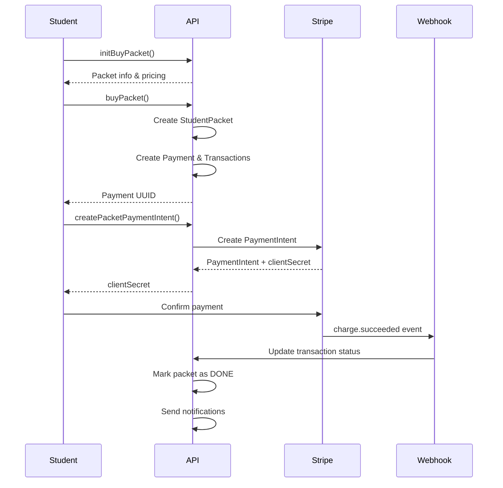
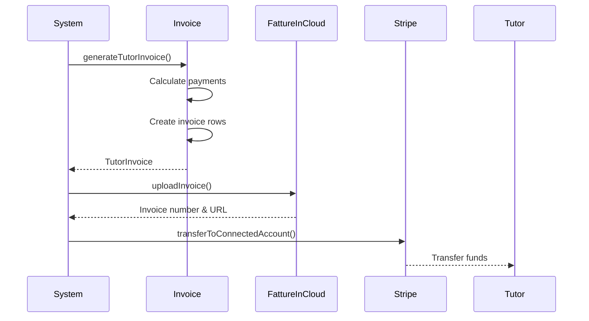

## Introduction

The Schoolr Payments API handles all payment operations including:

- **Stripe Payment Integration**: Process student payments for lessons and packets
- **Webhook Handling**: Real-time payment status updates from Stripe
- **Invoice Generation**: Automated tutor invoices with Fatture in Cloud integration
- **Payment Tracking**: Complete payment lifecycle management

## Architecture

The payments system consists of three main components:

### 1. Payment Processing

**Resource**: `BuyPacketResource` (GraphQL)

Handles lesson packet purchases and payment initialization:
- Packet selection and validation
- Payment intent creation
- Multi-student payment splitting
- Home lesson markup calculations

### 2. Stripe Integration

**Resource**: `StripeWebhookResource` (REST)

Processes webhook events from Stripe:
- Payment success notifications
- Refund processing
- Account status updates

**Service**: `StripeService`

Manages Stripe API interactions:
- Payment intent creation
- Connected account management
- Transfer operations to tutors
- Payment capture and cancellation

### 3. Invoice Management

**Resource**: `InvoiceResource` (GraphQL)

Generates and manages tutor invoices:
- Monthly invoice generation
- Fatture in Cloud synchronization
- Invoice status tracking
- Payment reconciliation

## Payment Flow

### Lesson Packet Purchase



### Tutor Payout Process



## Payment Modes

The system supports multiple payment modes:

<CardGroup cols={2}>
  <Card title="SINGLE" icon="credit-card">
    Direct Stripe payment for individual transactions
  </Card>
  <Card title="PACKET" icon="box">
    Pre-purchased lesson hours used from student packets
  </Card>
  <Card title="VOUCHER" icon="ticket">
    Promotional vouchers redeemed for lessons
  </Card>
  <Card title="FREE" icon="gift">
    Free lessons (admin-granted packets)
  </Card>
</CardGroup>

## Payment Status Lifecycle

```
INITIALIZED → PENDING → DONE
                  ↓
              EXPIRED / CANCELED
```

- **INITIALIZED**: Payment created but not yet initiated
- **PENDING**: Payment intent created, awaiting confirmation
- **DONE**: Payment successfully completed
- **EXPIRED**: Payment window expired (4 days default)
- **CANCELED**: Payment manually canceled

## Pricing Calculations

### Base Pricing

Packets have three price components:
- **Tutor Price**: Amount paid to tutor
- **Final Price**: Price charged to students (includes platform fee)
- **Hour Rate**: Per-hour cost

### Home Lesson Markup

When `classroom.homeLesson = true`:

```kotlin
val markupQuoteAmount = lessonRate.calculateMarkup(hours = packet.hours)
totalAmount = packet.finalPrice + markupQuoteAmount
tutorAmount = packet.tutorPrice + markupQuoteAmount
```

Source: `BuyPacketResource.kt:166-171`

### Multi-Student Split

For group classrooms:

```kotlin
val quoteAmount = totalAmount / classroom.students.size
```

Each student pays an equal share of the total packet cost.

Source: `BuyPacketResource.kt:174`

## Key Entities

### Payment

The main payment entity tracking:
- Total amounts (student vs tutor)
- Transfer date and status
- Description and metadata
- Related transactions

### PaymentTransaction

Individual student transactions:
- Student-specific payment tracking
- Stripe payment intent ID
- Payment status and mode
- Invoice URL after completion

### StudentPacket

Lesson packet assignment:
- Classroom and packet association
- Usage tracking (used vs total hours)
- Payment status
- Expiration date

## Code References

- Payment Processing: `apps/schoolr-datamanagement/src/main/java/it/simultech/dm/resources/BuyPacketResource.kt`
- Stripe Webhooks: `apps/schoolr-datamanagement/src/main/java/it/simultech/dm/rest_resources/StripeWebhookResource.kt`
- Stripe Service: `apps/schoolr-datamanagement/src/main/java/it/simultech/dm/services/StripeService.kt`
- Payment Service: `apps/schoolr-datamanagement/src/main/java/it/simultech/dm/services/PaymentService.kt`
- Invoice Management: `apps/schoolr-datamanagement/src/main/java/it/simultech/dm/resources/InvoiceResource.kt`

## Next Steps

<CardGroup cols={3}>
  <Card title="Stripe Integration" icon="stripe" href="/api/payments/stripe">
    Learn about Stripe webhooks and payment processing
  </Card>
  <Card title="Invoice Generation" icon="file-invoice" href="/api/payments/invoices">
    Explore automated invoice generation
  </Card>
  <Card title="Classrooms API" icon="school" href="/api/classrooms/overview">
    Understand classroom structure
  </Card>
</CardGroup>