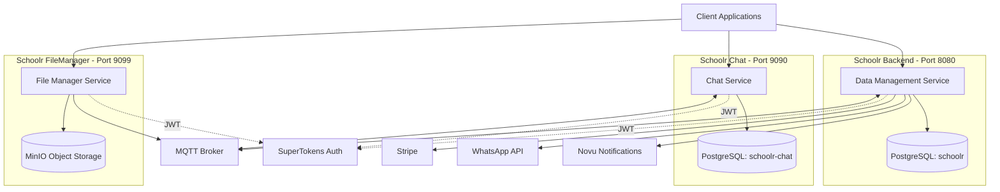
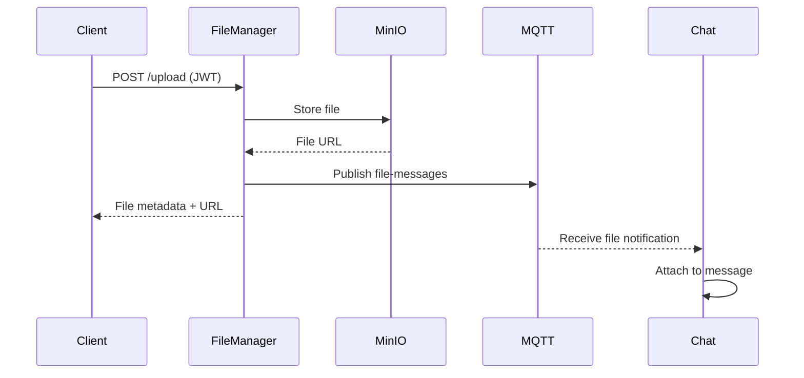

# System Architecture

Schoolor Backend follows a **microservices architecture** pattern with three independent services communicating via MQTT messaging. Each service has a specific domain responsibility and can be deployed, scaled, and maintained independently.

## Architecture Diagram



## Service Overview

<CardGroup cols={3}>
  <Card title="Data Management" icon="database">
    **Port**: 8080  
    **Database**: `schoolr`  
    **API**: GraphQL + REST
  </Card>
  <Card title="Chat Service" icon="messages">
    **Port**: 9090  
    **Database**: `schoolr-chat`  
    **API**: GraphQL + Subscriptions
  </Card>
  <Card title="File Manager" icon="folder">
    **Port**: 9099  
    **Storage**: MinIO  
    **API**: REST + MQTT Events
  </Card>
</CardGroup>

---

## Schoolr Data Management

### Responsibilities

The **Data Management** service is the core of the platform, handling:

- **GraphQL API** - Main business logic queries and mutations
- **User Management** - Authentication, profiles, roles, permissions
- **Payment Processing** - Stripe integration for subscriptions and payments
- **Notifications** - Novu integration for multi-channel notifications
- **WhatsApp Integration** - Messaging and notifications via WhatsApp Business API
- **Invoicing** - Fatture in Cloud integration for Italian invoicing
- **SMS Service** - SMS notifications and OTP
- **Virtual Classroom** - TheLessonSpace integration
- **Memorization Tools** - Memoraiz integration
- **Scheduled Jobs** - Background tasks and cron jobs

### Technology Stack

```yaml
Framework: Quarkus 3.2.9
Language: Kotlin 1.9.21
Database: PostgreSQL (database: schoolr)
Migrations: Liquibase
API: SmallRye GraphQL
Messaging: MQTT (SmallRye Reactive Messaging)
Auth: SmallRye JWT + SuperTokens
Cache: Caffeine (for account data)
```

### Configuration

Key configuration from `application.yaml`:

```yaml
quarkus:
  http:
    port: 8080  # Default port
  datasource:
    db-kind: postgresql
    jdbc:
      url: jdbc:postgresql://localhost:5432/schoolr
  liquibase:
    migrate-at-start: true  # Dev profile only
    change-log: db/changelog/master.xml
```

### Key Integrations

<CardGroup cols={2}>
  <Card title="Stripe" icon="credit-card">
    Payment processing with webhook support for real-time payment events
  </Card>
  <Card title="SuperTokens" icon="lock">
    Modern authentication with session management and JWT validation
  </Card>
  <Card title="Novu" icon="bell">
    Multi-channel notification engine (email, SMS, push, in-app)
  </Card>
  <Card title="WhatsApp Business" icon="whatsapp">
    Direct messaging integration with template support
  </Card>
  <Card title="Fatture in Cloud" icon="file-invoice">
    Automated Italian invoicing and accounting
  </Card>
  <Card title="TheLessonSpace" icon="video">
    Virtual classroom and video conferencing
  </Card>
</CardGroup>

### Database Schema

The service uses **Liquibase** for schema management:

- **Schema Location**: `db/changelog/master.xml`
- **Auto-migration**: Enabled in `%dev` profile, disabled in `%prod`
- **Schema**: `public` (configurable via `POSTGRES_SCHEMA`)

<Note>
  The data management database is completely separate from the chat database, ensuring data isolation and independent scaling.
</Note>

---

## Schoolr Chat Service

### Responsibilities

- **Real-time Messaging** - Chat rooms, direct messages, group conversations
- **GraphQL Subscriptions** - Live message updates using GraphQL subscriptions
- **Message Persistence** - All messages stored in PostgreSQL
- **MQTT Integration** - Pub/sub for real-time message delivery
- **File Attachment Handling** - Integration with File Manager for media messages
- **Lesson Request Messages** - Specialized messaging for lesson bookings

### Technology Stack

```yaml
Framework: Quarkus 3.2.9
Language: Kotlin 1.9.21
Database: PostgreSQL (database: schoolr-chat)
API: SmallRye GraphQL with Subscriptions
Messaging: MQTT (SmallRye Reactive Messaging)
Auth: SmallRye JWT + SuperTokens
```

### Configuration

```yaml
quarkus:
  http:
    port: 9090
  datasource:
    jdbc:
      url: jdbc:postgresql://localhost:5432/schoolr-chat
  smallrye-graphql:
    ui:
      always-include: true  # GraphQL UI available
```

### MQTT Topics

The chat service subscribes to and publishes on multiple MQTT topics:

```yaml
Incoming:
  - chat-message/#                 # General chat messages
  - chat-message-filemanager/#     # File upload notifications
  - chat-message-lessonrequest/#   # Lesson request messages

Outgoing:
  - chat-messages-out              # Outgoing chat events
  - chat-topic-messages-out        # Topic-specific messages
```

<Info>
  MQTT topics use **shared subscriptions** (`$share/g/...`) for load balancing across multiple instances.
</Info>

### Key Entities

- **Room** - Chat room/conversation
- **Message** - Individual chat messages
- **Subscriber** - Room participants
- **MessageMetadata** - Additional message context
- **RoomMetadata** - Room configuration and settings

### GraphQL API Example

```graphql
type Message {
  id: ID!
  roomId: ID!
  senderId: ID!
  content: String!
  timestamp: DateTime!
  metadata: MessageMetadata
}

type Room {
  id: ID!
  name: String
  subscribers: [Subscriber!]!
  messages: [Message!]!
  metadata: RoomMetadata
}

type Subscription {
  onNewMessage(roomId: ID!): Message!
  onRoomUpdate(roomId: ID!): Room!
}
```

---

## Schoolr File Manager

### Responsibilities

- **File Upload/Download** - Secure file handling with authentication
- **MinIO Integration** - S3-compatible object storage
- **Large File Support** - Up to 300MB per file
- **MQTT Notifications** - Publish file events to other services
- **Media Serving** - Public media endpoint for file access

### Technology Stack

```yaml
Framework: Quarkus 3.2.9
Language: Kotlin 1.9.21
Storage: MinIO (S3-compatible)
Messaging: MQTT (SmallRye Reactive Messaging)
Auth: SmallRye JWT + SuperTokens
```

### Configuration

```yaml
quarkus:
  http:
    port: 9099
    limits:
      max-body-size: 300M  # Large file support

minio:
  host: http://127.0.0.1
  port: 9000
  bucketname: schoolr
  username: ${MINIO_USERNAME}
  password: ${MINIO_PASSWORD}
```

<Warning>
  The 300MB file size limit is enforced at the HTTP level. Ensure your reverse proxy and load balancer also support large file uploads.
</Warning>

### MQTT Integration

Publishes file events to MQTT topics:

```yaml
Outgoing:
  - file-messages  # File upload/delete notifications
```

Other services (especially chat) subscribe to these events to handle file attachments in messages.

### MinIO Storage Structure

```
Bucket: schoolr
├── media/           # Public media files
├── documents/       # Private documents
├── avatars/         # User profile images
└── attachments/     # Chat attachments
```

---

## Shared Libraries

All three services depend on shared libraries for common functionality:

### schoolr-libs (v2.2-SNAPSHOT)

- **Utilities** - Common helper functions
- **WhatsApp Client** - Reusable WhatsApp API client
- **DTOs** - Shared data transfer objects
- **Logging** - Standardized logging configuration

### schoolr-config (v1.1-SNAPSHOT)

- **Configuration** - Shared configuration classes
- **Constants** - Application-wide constants

### schoolr-persistence-libs

- **Predicate Builder** - Dynamic query building
- **Persistence Support** - Common database utilities

<Note>
  Shared libraries **must be built and installed** to the local Maven repository before running any application:
  ```bash
  ./mvnw clean install -pl libs/schoolr-libs,libs/schoolr-config,libs/schoolr-persistence-libs -am -DskipTests
  ```
</Note>

---

## Communication Patterns

### Synchronous Communication

- **GraphQL/REST** - Client-to-service communication
- **Direct HTTP** - Service health checks

### Asynchronous Communication

- **MQTT Pub/Sub** - Event-driven messaging between services
- **Shared Subscriptions** - Load balancing with `$share/g/topic`

### Example: File Upload Flow



---

## Deployment Architecture

### Container Images

Each service builds container images using **Jib**:

```yaml
Registry: gitlab.simultech.it:4567
Images:
  - schoolr2/schoolr-back/schoolr-datamanagement
  - schoolr2/schoolr-back/schoolr-chat
  - schoolr2/schoolr-back/schoolr-filemanager
```

### Kubernetes Deployment

- **Helm Charts** - Declarative Kubernetes deployments
- **GitLab CI/CD** - Automated build and deploy pipeline
- **Horizontal Scaling** - Each service can scale independently

### Environment Variables

Production deployments require environment-based configuration:

```bash
# Database
POSTGRES_HOST=db.example.com
POSTGRES_USER=schoolr-user
POSTGRES_PASSWORD=secure-password

# Auth
AUTH_CONNECTION_URI=https://auth.example.com
AUTH_API_KEY=your-api-key
JWT_KEY_PATH=/keys/publickey-prod.pem

# MQTT
MQTT_HOST=mqtt.example.com
MQTT_PORT=1883

# MinIO
MINIO_HOST=https://minio.example.com
MINIO_USERNAME=admin
MINIO_PASSWORD=secure-password

# CORS
CORS_ORIGINS=https://app.schoolr.net,https://schoolr.net
```

<Warning>
  **Never commit secrets to version control**. Use Kubernetes Secrets, environment variables, or a secret management service.
</Warning>

---

## Scalability & Performance

### Horizontal Scaling

- **Stateless Services** - All services are stateless and can scale horizontally
- **MQTT Shared Subscriptions** - Load balancing across instances
- **Database Connection Pooling** - Efficient database resource usage

### Caching

- **Caffeine Cache** - In-memory caching for frequently accessed data (e.g., account data)
- **Cache Metrics** - Enabled in dev mode for monitoring

### Performance Optimizations

- **HTTP Compression** - Enabled in production (`%prod` profile)
- **Quarkus Optimizations** - Fast startup and low memory footprint
- **Database Indexes** - Managed via Liquibase migrations

<Info>
  Quarkus is optimized for containerized environments, with fast startup times (< 1 second) and low memory usage.
</Info>
